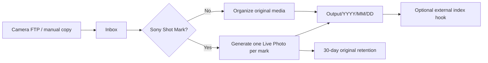

# Sony Camera Inbox Organizer

[简体中文](README.zh-CN.md)

Sony Camera Inbox Organizer watches a camera upload directory, organizes ordinary
photos and videos by capture time, and converts Sony videos with Shot Marks into
Apple-compatible JPEG+MOV Live Photo pairs. FTP is optional: a NAS FTP service,
file sync, or a manual copy can all feed the same inbox.



## Highlights

| Capability | Default | Behavior |
| --- | --- | --- |
| Automatic watcher | On | Waits for stable uploads before processing |
| Manual scan | Always available | Works even when automatic watching is off |
| Ordinary media organization | On | Moves photos and unmarked videos by capture date |
| Sony Shot Mark conversion | On | Produces a 3-second Live Photo for every mark |
| Date directories | On | Uses `YYYY/MM/DD`; may be disabled or customized |
| Original marked clips | Archive | Retained for 30 days before cleanup |
| Photo-app integration | Off | Runs an optional external command after publishing |

The JPEG metadata is generated from a deterministic 102-byte Apple MakerNote.
No user photo, thumbnail, GPS coordinate, device identifier, or private template
is bundled or required.

## Quick Start

Requirements: Docker Engine with Compose. No Git checkout, local compilation,
or application YAML is required for the first start. Copy and run this entire
block on the NAS or Linux host:

```bash
mkdir -p sony-camera-inbox/config sony-camera-inbox/data/PhotoInbox/sony-camera
cd sony-camera-inbox

cat > compose.yaml <<'YAML'
services:
  sony-camera-inbox:
    image: docker.io/ylongwang/sony-camera-inbox-organizer:latest
    container_name: sony-camera-inbox-organizer
    restart: unless-stopped
    user: "${PUID:-1000}:${PGID:-1000}"
    environment:
      TZ: "${TZ:-UTC}"
      CONFIG_PATH: /config/config.yaml
      STATE_PATH: /config/state.sqlite
    ports:
      - "18088:8080"
    volumes:
      - ./config:/config
      - ./data:/data
    security_opt:
      - no-new-privileges:true
YAML

printf 'PUID=%s\nPGID=%s\nTZ=%s\n' "$(id -u)" "$(id -g)" "${TZ:-UTC}" > .env
docker compose pull
docker compose up -d
docker compose ps
```

Open **`http://NAS-IP:18088`**. For example, if the NAS address is
`192.168.1.20`, open `http://192.168.1.20:18088`. The browser always uses port
**18088** in this setup. Port `8080` is internal to the container and should not
be opened directly.

The application creates `config/config.yaml` automatically. Open the Settings
or YAML page to change the organizer paths and behavior after the Web UI is
running. The default setup can be used immediately:

| Purpose | Host path | Path shown in the Web UI |
| --- | --- | --- |
| Camera FTP/manual inbox | `./data/PhotoInbox/sony-camera` | `/data/PhotoInbox/sony-camera` |
| Organized photo library | `./data/Photos/01_memories/sony` | `/data/Photos/01_memories/sony` |
| 30-day marked originals | `./data/PhotoInbox/.retention/shotmark-originals` | `/data/PhotoInbox/.retention/shotmark-originals` |

Point the camera FTP task at the host-side inbox, or copy a file there manually.
The application creates the output, staging, retention, and duplicate
directories when needed.

Docker cannot access arbitrary host directories that were not mounted when the
container started. To use an existing NAS photo root, change only the second
volume in `compose.yaml`, then run `docker compose up -d` again:

```yaml
    volumes:
      - ./config:/config
      - /your/NAS/media-root:/data
```

Keep using `/data/...` paths in the Web UI; `/data` now represents that host
directory. This is the only host path that a typical NAS deployment needs to
choose.

## Processing Rules

1. A file must keep the same size and modification time for the configured
   number of checks and must exceed the minimum age.
2. MP4/MOV files are inspected for Sony `NonRealTimeMeta` and `_ShotMark*`
   packets without reading the large media-data box into memory.
3. Marked videos generate one JPEG+MOV pair per mark. The MOV uses H.264/AAC,
   QuickTime `qt`, direct `moov/meta`, a timed `mebx` still-image track, and one
   primary `mdat`.
4. Other supported photos, RAW files, and videos are moved with a capture-time
   filename. Identical collisions are preserved in the duplicate directory.
5. Generated pairs are published MOV first and JPEG second. An optional hook is
   invoked only after publishing succeeds.

Supported ordinary media extensions currently include ARW, HEIC/HEIF, JPEG,
PNG, AVI, M4V, MOV, MP4, and MTS.

## Configuration

The Settings form and YAML editor both update `/config/config.yaml`; they are
two views of the same source of truth. The file is generated automatically on
first start. This is the complete default configuration for reference or direct
editing:

```yaml
schema_version: 1
paths:
  input: /data/PhotoInbox/sony-camera
  output: /data/Photos/01_memories/sony
  staging: /data/PhotoInbox/.staging/sony-camera
  retention: /data/PhotoInbox/.retention/shotmark-originals
  duplicates: /data/PhotoInbox/.duplicates/sony-camera
automation:
  enabled: true
  recursive: false
  poll_seconds: 2.0
  stable_cycles: 3
  minimum_age_seconds: 4.0
organization:
  organize_regular_media: true
  sort_by_capture_date: true
  date_pattern: "%Y/%m/%d"
live_photo:
  enabled: true
  duration_seconds: 3.0
  height: 1080
  fps: 30
  crf: 18
  preset: veryfast
  video_threads: 2
  audio_bitrate: 192k
originals:
  action: archive
  retention_days: 30
hooks:
  after_publish: []
  timeout_seconds: 60
```

`Scan now` always requests a scan, including when `automation.enabled` is
`false`. Failed files are not retried forever by the automatic watcher; a
manual scan retries them after the source file is fixed.

## Photo-App Integration

The public image contains no fnOS, Immich, PhotoPrism, or other private SDK.
Set `hooks.after_publish` to an executable and arguments if your photo app needs
an explicit refresh. The process receives:

| Environment variable | Value |
| --- | --- |
| `CAMERA_INBOX_JOB_KIND` | `regular` or `live_photo` |
| `CAMERA_INBOX_SOURCE` | Original input path |
| `CAMERA_INBOX_OUTPUT_DIRECTORY` | Destination directory |
| `CAMERA_INBOX_OUTPUTS_JSON` | JSON array of published paths |

Keep credentials and proprietary SDKs outside this repository and mount only a
small adapter executable into the container. Many photo apps already watch the
output directory and need no hook.

## Container Publishing

Official images are built on GitHub-hosted runners, not on a maintainer's
computer. Ordinary commits and pull requests only run tests and a non-pushing
image build. A maintainer publishes a selected revision explicitly:

1. Open **Actions > Publish container > Run workflow** on GitHub.
2. Enter a branch, tag, or full/short commit SHA in `source_ref`.
3. Leave `publish_latest` enabled to update the image used by Quick Start.
4. Optionally enter a version such as `0.2.0` in `release_tag`.

The workflow builds `linux/amd64` and `linux/arm64`, pushes the same image to
Docker Hub and GHCR, adds an immutable `sha-xxxxxxx` tag, and verifies both
platforms in the published manifest. It requires the repository secrets
`DOCKERHUB_USERNAME` and `DOCKERHUB_TOKEN`. A normal commit never publishes or
overwrites `latest` automatically.

## Development

Cloning the repository is only required for source development or local image
builds:

```bash
git clone https://github.com/ylongw/sony-camera-inbox-organizer.git
cd sony-camera-inbox-organizer
python -m venv .venv
. .venv/bin/activate
pip install -e '.[test]'
pytest
sony-camera-inbox
```

Build and run a local image through the repository Compose file:

```bash
cp .env.example .env
mkdir -p runtime/config runtime/data/PhotoInbox/sony-camera
docker build -t sony-camera-inbox-organizer:local .
IMAGE=sony-camera-inbox-organizer:local docker compose up -d
```

FFmpeg and ExifTool must be installed for real conversion. See
[Architecture](docs/ARCHITECTURE.md), [Security](SECURITY.md), and
[third-party notices](THIRD_PARTY_NOTICES.md).

## License

The application source is MIT licensed. The Docker image also distributes
FFmpeg, ExifTool, and Python dependencies under their respective licenses.
