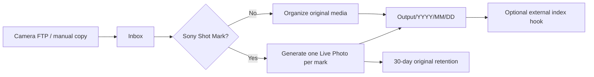

# Sony Camera Inbox Organizer

[简体中文](README.zh-CN.md)

Sony Camera Inbox Organizer watches a camera upload directory, organizes ordinary
photos and videos by capture time, and converts Sony videos with Shot Marks into
Apple-compatible JPEG+MOV Live Photo pairs. FTP is optional: a NAS FTP service,
file sync, or a manual copy can all feed the same inbox.



## Highlights

| Capability | Default | Behavior |
| --- | --- | --- |
| Automatic watcher | On | Waits for stable uploads before processing |
| Manual scan | Always available | Works even when automatic watching is off |
| Ordinary media organization | On | Moves photos and unmarked videos by capture date |
| Sony Shot Mark conversion | On | Produces a 3-second Live Photo for every mark |
| Date directories | On | Uses `YYYY/MM/DD`; may be disabled or customized |
| Original marked clips | Archive | Retained for 30 days before cleanup |
| Photo-app integration | Off | Runs an optional external command after publishing |

The JPEG metadata is generated from a deterministic 102-byte Apple MakerNote.
No user photo, thumbnail, GPS coordinate, device identifier, or private template
is bundled or required.

## Quick Start

Requirements: Docker Engine with Compose, and one host directory containing the
inbox and output paths.

```bash
git clone https://github.com/ylongw/sony-camera-inbox-organizer.git
cd sony-camera-inbox-organizer
mkdir -p runtime/config runtime/data/inbox
cp config.example.yaml runtime/config/config.yaml
docker compose up -d --build
```

Open `http://NAS-IP:8080`. The Web UI and the worker both read
`runtime/config/config.yaml`. Web changes are written atomically; direct YAML
edits appear in the Web UI on the next page load.

For a real NAS, mount one common parent into `/data` instead of mounting the
inbox and output separately:

```yaml
volumes:
  - /your/nas/media-root:/data
  - /your/app-config:/config
```

Then set paths such as `/data/PhotoInbox/camera` and `/data/Photos/camera` in
the Web UI. Run the container as the UID/GID that owns those directories.

## Processing Rules

1. A file must keep the same size and modification time for the configured
   number of checks and must exceed the minimum age.
2. MP4/MOV files are inspected for Sony `NonRealTimeMeta` and `_ShotMark*`
   packets without reading the large media-data box into memory.
3. Marked videos generate one JPEG+MOV pair per mark. The MOV uses H.264/AAC,
   QuickTime `qt`, direct `moov/meta`, a timed `mebx` still-image track, and one
   primary `mdat`.
4. Other supported photos, RAW files, and videos are moved with a capture-time
   filename. Identical collisions are preserved in the duplicate directory.
5. Generated pairs are published MOV first and JPEG second. An optional hook is
   invoked only after publishing succeeds.

Supported ordinary media extensions currently include ARW, HEIC/HEIF, JPEG,
PNG, AVI, M4V, MOV, MP4, and MTS.

## Configuration

`config.example.yaml` is the complete schema. Important switches:

```yaml
automation:
  enabled: true
organization:
  organize_regular_media: true
  sort_by_capture_date: true
live_photo:
  enabled: true
originals:
  action: archive
  retention_days: 30
```

`Scan now` always requests a scan, including when `automation.enabled` is
`false`. Failed files are not retried forever by the automatic watcher; a
manual scan retries them after the source file is fixed.

## Photo-App Integration

The public image contains no fnOS, Immich, PhotoPrism, or other private SDK.
Set `hooks.after_publish` to an executable and arguments if your photo app needs
an explicit refresh. The process receives:

| Environment variable | Value |
| --- | --- |
| `CAMERA_INBOX_JOB_KIND` | `regular` or `live_photo` |
| `CAMERA_INBOX_SOURCE` | Original input path |
| `CAMERA_INBOX_OUTPUT_DIRECTORY` | Destination directory |
| `CAMERA_INBOX_OUTPUTS_JSON` | JSON array of published paths |

Keep credentials and proprietary SDKs outside this repository and mount only a
small adapter executable into the container. Many photo apps already watch the
output directory and need no hook.

## Development

```bash
python -m venv .venv
. .venv/bin/activate
pip install -e '.[test]'
pytest
sony-camera-inbox
```

FFmpeg and ExifTool must be installed for real conversion. See
[Architecture](docs/ARCHITECTURE.md), [Security](SECURITY.md), and
[third-party notices](THIRD_PARTY_NOTICES.md).

## License

The application source is MIT licensed. The Docker image also distributes
FFmpeg, ExifTool, and Python dependencies under their respective licenses.
