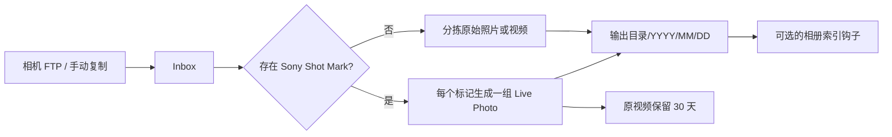

# Sony 相机 Inbox 自动分拣器

[English](README.md)

Sony Camera Inbox Organizer 监控相机上传目录，按拍摄时间整理普通照片和视频，并把带
Sony Shot Mark 的视频转换为 Apple 兼容的 JPEG+MOV Live Photo。输入不绑定 FTP：
NAS 自带 FTP、文件同步和手动复制都可以写入同一个 Inbox。



## 功能

| 能力 | 默认值 | 行为 |
| --- | --- | --- |
| 自动监控 | 开启 | 文件稳定后才处理，避免读取未完成的 FTP 上传 |
| 手动扫描 | 始终可用 | 自动监控关闭时仍可执行 |
| 普通媒体分拣 | 开启 | 照片和无 Shot Mark 视频按拍摄日期移动 |
| Shot Mark 转换 | 开启 | 每个标记生成一段 3 秒 Live Photo |
| 日期目录 | 开启 | 默认 `YYYY/MM/DD`，可关闭或修改 |
| 带标记原视频 | 归档 | 保留 30 天后清理 |
| 相册软件集成 | 关闭 | 发布成功后可执行外部命令 |

JPEG 使用程序生成的 102 字节确定性 Apple MakerNote，不需要用户上传 Live Photo
模板，也不包含个人照片像素、缩略图、GPS、设备 UUID 或其他私人元数据。

## 快速开始

需要 Docker Engine 和 Docker Compose。Docker Hub 预构建镜像同时支持
`linux/amd64` 和 `linux/arm64`。

### 方案一：直接拉取镜像（推荐）

项目将 Docker Compose 作为标准部署方式，此方案不需要在 NAS 上编译。

#### 1. 准备部署文件

```bash
git clone https://github.com/ylongw/sony-camera-inbox-organizer.git
cd sony-camera-inbox-organizer
cp .env.example .env
mkdir -p runtime/config runtime/data/PhotoInbox/sony-camera
cp config.example.yaml runtime/config/config.yaml
```

#### 2. 拉取预构建镜像

```bash
docker compose pull
```

默认拉取 `docker.io/ylongwang/sony-camera-inbox-organizer:latest`。

#### 3. 部署并启动容器

```bash
docker compose up -d
docker compose ps
```

#### 4. 打开 Web 管理页面

容器启动后打开 **`http://NAS-IP:18088`**。例如 NAS 地址是
`192.168.1.20`，则访问 `http://192.168.1.20:18088`。

| 端口 | 默认值 | 用途 |
| --- | --- | --- |
| 宿主机 Web 端口 | `18088` | 浏览器实际访问的端口 |
| 容器内部端口 | `8080` | 仅在容器内部使用，由 Compose 映射 |

如需修改浏览器访问端口，在 `.env` 中修改 `WEB_PORT=18088`，然后再次执行
`docker compose up -d`。通常不需要修改容器内部端口。

使用仓库内的相对路径时，把相机照片上传或复制到
`runtime/data/PhotoInbox/sony-camera`。在 NAS 上部署时，在 `.env` 中把
`MEDIA_ROOT` 改成 Inbox 和照片库共同的宿主机根目录，并把 `PUID`、`PGID` 改成该
目录所有者。`MEDIA_ROOT` 始终挂载为容器内的 `/data`，因此通常不用修改 YAML 路径。

默认目录已经给出完整命名：

| 用途 | 容器内路径 | `MEDIA_ROOT` 下的宿主机路径 |
| --- | --- | --- |
| 相机 FTP/手动导入 Inbox | `/data/PhotoInbox/sony-camera` | `PhotoInbox/sony-camera` |
| 整理后的照片库 | `/data/Photos/01_memories/sony/YYYY/MM/DD` | `Photos/01_memories/sony/YYYY/MM/DD` |
| 转换暂存 | `/data/PhotoInbox/.staging/sony-camera` | `PhotoInbox/.staging/sony-camera` |
| 带标记原片保留 30 天 | `/data/PhotoInbox/.retention/shotmark-originals` | `PhotoInbox/.retention/shotmark-originals` |
| 重复文件隔离 | `/data/PhotoInbox/.duplicates/sony-camera` | `PhotoInbox/.duplicates/sony-camera` |

启动前只需要确保 Inbox 存在，其余托管目录由程序创建。相机 FTP 任务应填写宿主机
一侧的 Inbox 路径。

### 方案二：从源码构建

高级用户可以从当前源码构建本地镜像，再通过同一份 Compose 启动：

```bash
docker build -t sony-camera-inbox-organizer:local .
IMAGE=sony-camera-inbox-organizer:local docker compose up -d
```

Web UI 与 Worker 读取同一个 `runtime/config/config.yaml`：网页修改会原子写回；
直接编辑 YAML 后，重新打开页面即可看到新值。

## 分支逻辑

1. 文件大小和修改时间连续稳定若干轮，并超过最小年龄后才进入处理。
2. 对 MP4/MOV 读取 Sony `NonRealTimeMeta` 和 `_ShotMark*`，不会把大型 `mdat`
   一次性载入内存。
3. 带标记视频的每个标记生成一组 JPEG+MOV；MOV 使用 H.264/AAC、QuickTime
   `qt`、直接 `moov/meta`、定时 `mebx` 静态帧轨道和单一主 `mdat`。
4. 其他照片、RAW 和视频按拍摄时间重命名并移动；同名且内容相同的文件保存在重复
   文件目录，不会直接删除或覆盖。
5. Live Photo 先发布 MOV、再发布 JPEG；全部成功后才执行可选钩子。

普通分拣当前支持 ARW、HEIC/HEIF、JPEG、PNG、AVI、M4V、MOV、MP4 和 MTS。

## 配置

完整结构见 `config.example.yaml`。当 `MEDIA_ROOT` 挂载为 `/data` 时，默认路径可以
直接使用：

```yaml
paths:
  input: /data/PhotoInbox/sony-camera
  output: /data/Photos/01_memories/sony
  staging: /data/PhotoInbox/.staging/sony-camera
  retention: /data/PhotoInbox/.retention/shotmark-originals
  duplicates: /data/PhotoInbox/.duplicates/sony-camera
```

主要开关：

```yaml
automation:
  enabled: true
organization:
  organize_regular_media: true
  sort_by_capture_date: true
live_photo:
  enabled: true
originals:
  action: archive
  retention_days: 30
```

“立即扫描”不受 `automation.enabled` 限制。自动模式不会无限重试失败文件；修复源文件
后可通过手动扫描重试。

## 相册软件集成

公开镜像不包含飞牛、Immich、PhotoPrism 或其他私有 SDK。如果相册软件需要显式刷新，
可以把一个外部适配器挂入容器，并在 `hooks.after_publish` 中填写命令。适配器会收到：

| 环境变量 | 内容 |
| --- | --- |
| `CAMERA_INBOX_JOB_KIND` | `regular` 或 `live_photo` |
| `CAMERA_INBOX_SOURCE` | 原始输入路径 |
| `CAMERA_INBOX_OUTPUT_DIRECTORY` | 目标目录 |
| `CAMERA_INBOX_OUTPUTS_JSON` | 已发布文件路径的 JSON 数组 |

账号、Token 和私有 SDK 应保留在仓库外。若相册软件原生监控输出目录，钩子保持空数组
即可。

## 开发

```bash
python -m venv .venv
. .venv/bin/activate
pip install -e '.[test]'
pytest
sony-camera-inbox
```

真实转换还需要 FFmpeg 和 ExifTool。详见[架构](docs/ARCHITECTURE.md)、
[安全说明](SECURITY.md)和[第三方许可](THIRD_PARTY_NOTICES.md)。

## 许可证

应用源码使用 MIT License。Docker 镜像中的 FFmpeg、ExifTool 和 Python 依赖分别遵循
各自许可证。
