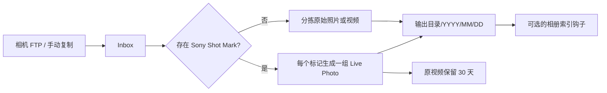

# Sony 相机 Inbox 自动分拣器

[English](README.md)

Sony Camera Inbox Organizer 监控相机上传目录，按拍摄时间整理普通照片和视频，并把带
Sony Shot Mark 的视频转换为 Apple 兼容的 JPEG+MOV Live Photo。输入不绑定 FTP：
NAS 自带 FTP、文件同步和手动复制都可以写入同一个 Inbox。



## 功能

| 能力 | 默认值 | 行为 |
| --- | --- | --- |
| 自动监控 | 开启 | 文件稳定后才处理，避免读取未完成的 FTP 上传 |
| 手动扫描 | 始终可用 | 自动监控关闭时仍可执行 |
| 普通媒体分拣 | 开启 | 照片和无 Shot Mark 视频按拍摄日期移动 |
| Shot Mark 转换 | 开启 | 每个标记生成一段 3 秒 Live Photo |
| 日期目录 | 开启 | 默认 `YYYY/MM/DD`，可关闭或修改 |
| 带标记原视频 | 归档 | 保留 30 天后清理 |
| 相册软件集成 | 关闭 | 发布成功后可执行外部命令 |

JPEG 使用程序生成的 102 字节确定性 Apple MakerNote，不需要用户上传 Live Photo
模板，也不包含个人照片像素、缩略图、GPS、设备 UUID 或其他私人元数据。

## 快速开始

需要 Docker Engine 和 Docker Compose。首次启动不需要 Git、不需要本地编译，也不需要
提前准备应用 YAML。普通用户在 NAS 或 Linux 主机上复制并执行下面整段命令即可：

```bash
mkdir -p sony-camera-inbox/config sony-camera-inbox/data/PhotoInbox/sony-camera
cd sony-camera-inbox

cat > compose.yaml <<'YAML'
services:
  sony-camera-inbox:
    image: docker.io/ylongwang/sony-camera-inbox-organizer:latest
    container_name: sony-camera-inbox-organizer
    restart: unless-stopped
    user: "${PUID:-1000}:${PGID:-1000}"
    environment:
      TZ: "${TZ:-UTC}"
      CONFIG_PATH: /config/config.yaml
      STATE_PATH: /config/state.sqlite
    ports:
      - "18088:8080"
    volumes:
      - ./config:/config
      - ./data:/data
    security_opt:
      - no-new-privileges:true
YAML

printf 'PUID=%s\nPGID=%s\nTZ=%s\n' "$(id -u)" "$(id -g)" "${TZ:-UTC}" > .env
docker compose pull
docker compose up -d
docker compose ps
```

然后打开 **`http://NAS-IP:18088`**。例如 NAS 地址是 `192.168.1.20`，则访问
`http://192.168.1.20:18088`。在这套默认部署中，浏览器始终使用 **18088**；
`8080` 只是容器内部端口，不需要、也不应该直接访问。

程序首次启动会自动生成 `config/config.yaml`。网页打开后，再通过“设置”页面或 YAML
页面修改分拣路径和功能开关。默认目录可以立即使用：

| 用途 | 宿主机路径 | Web 页面中填写的路径 |
| --- | --- | --- |
| 相机 FTP/手动导入 Inbox | `./data/PhotoInbox/sony-camera` | `/data/PhotoInbox/sony-camera` |
| 整理后的照片库 | `./data/Photos/01_memories/sony` | `/data/Photos/01_memories/sony` |
| 带标记原片保留 30 天 | `./data/PhotoInbox/.retention/shotmark-originals` | `/data/PhotoInbox/.retention/shotmark-originals` |

把相机 FTP 任务指向宿主机一侧的 Inbox，或者手动复制一个文件进去即可。输出、暂存、
原片保留和重复文件目录会由程序按需创建。

Docker 无法访问容器启动时没有挂载的宿主机目录。如果需要使用 NAS 上已经存在的照片
根目录，只修改 `compose.yaml` 中第二条 volume，然后重新执行
`docker compose up -d`：

```yaml
    volumes:
      - ./config:/config
      - /你的/NAS/媒体根目录:/data
```

Web 页面中仍然填写 `/data/...`；此时 `/data` 就代表该宿主机目录。普通 NAS 用户实际
只需要选择这一处宿主机路径。

## 分支逻辑

1. 文件大小和修改时间连续稳定若干轮，并超过最小年龄后才进入处理。
2. 对 MP4/MOV 读取 Sony `NonRealTimeMeta` 和 `_ShotMark*`，不会把大型 `mdat`
   一次性载入内存。
3. 带标记视频的每个标记生成一组 JPEG+MOV；MOV 使用 H.264/AAC、QuickTime
   `qt`、直接 `moov/meta`、定时 `mebx` 静态帧轨道和单一主 `mdat`。
4. 其他照片、RAW 和视频按拍摄时间重命名并移动；同名且内容相同的文件保存在重复
   文件目录，不会直接删除或覆盖。
5. Live Photo 先发布 MOV、再发布 JPEG；全部成功后才执行可选钩子。

普通分拣当前支持 ARW、HEIC/HEIF、JPEG、PNG、AVI、M4V、MOV、MP4 和 MTS。

## 配置

“设置”表单和 YAML 编辑器都会修改 `/config/config.yaml`，只是同一配置的两种视图。
程序首次启动会自动生成该文件。下面是可以直接参考或复制编辑的完整默认配置：

```yaml
schema_version: 1
paths:
  input: /data/PhotoInbox/sony-camera
  output: /data/Photos/01_memories/sony
  staging: /data/PhotoInbox/.staging/sony-camera
  retention: /data/PhotoInbox/.retention/shotmark-originals
  duplicates: /data/PhotoInbox/.duplicates/sony-camera
automation:
  enabled: true
  recursive: false
  poll_seconds: 2.0
  stable_cycles: 3
  minimum_age_seconds: 4.0
organization:
  organize_regular_media: true
  sort_by_capture_date: true
  date_pattern: "%Y/%m/%d"
live_photo:
  enabled: true
  duration_seconds: 3.0
  height: 1080
  fps: 30
  crf: 18
  preset: veryfast
  video_threads: 2
  audio_bitrate: 192k
originals:
  action: archive
  retention_days: 30
hooks:
  after_publish: []
  timeout_seconds: 60
```

“立即扫描”不受 `automation.enabled` 限制。自动模式不会无限重试失败文件；修复源文件
后可通过手动扫描重试。

## 相册软件集成

公开镜像不包含飞牛、Immich、PhotoPrism 或其他私有 SDK。如果相册软件需要显式刷新，
可以把一个外部适配器挂入容器，并在 `hooks.after_publish` 中填写命令。适配器会收到：

| 环境变量 | 内容 |
| --- | --- |
| `CAMERA_INBOX_JOB_KIND` | `regular` 或 `live_photo` |
| `CAMERA_INBOX_SOURCE` | 原始输入路径 |
| `CAMERA_INBOX_OUTPUT_DIRECTORY` | 目标目录 |
| `CAMERA_INBOX_OUTPUTS_JSON` | 已发布文件路径的 JSON 数组 |

账号、Token 和私有 SDK 应保留在仓库外。若相册软件原生监控输出目录，钩子保持空数组
即可。

## 镜像发布

正式镜像统一由 GitHub-hosted runner 构建，不使用维护者电脑构建后上传。普通 commit 和
Pull Request 只运行测试及不推送的镜像构建。维护者需要明确选择一个版本进行发布：

1. 在 GitHub 打开 **Actions > Publish container > Run workflow**。
2. 在 `source_ref` 中填写 branch、tag、完整或短 commit SHA。
3. 保持 `publish_latest` 开启，即可更新快速开始使用的镜像。
4. 可选在 `release_tag` 中填写 `0.2.0` 这样的版本号。

工作流会构建 `linux/amd64` 和 `linux/arm64`，把同一镜像推送到 Docker Hub 和
GHCR，增加不可变的 `sha-xxxxxxx` 标签，并检查发布清单确实包含两个平台。仓库需要配置
`DOCKERHUB_USERNAME` 和 `DOCKERHUB_TOKEN`。普通 commit 不会自动发布，也不会覆盖
`latest`。

## 开发

只有源码开发或本地构建镜像才需要克隆 GitHub 仓库：

```bash
git clone https://github.com/ylongw/sony-camera-inbox-organizer.git
cd sony-camera-inbox-organizer
python -m venv .venv
. .venv/bin/activate
pip install -e '.[test]'
pytest
sony-camera-inbox
```

通过仓库中的 Compose 文件构建并运行本地镜像：

```bash
cp .env.example .env
mkdir -p runtime/config runtime/data/PhotoInbox/sony-camera
docker build -t sony-camera-inbox-organizer:local .
IMAGE=sony-camera-inbox-organizer:local docker compose up -d
```

真实转换还需要 FFmpeg 和 ExifTool。详见[架构](docs/ARCHITECTURE.md)、
[安全说明](SECURITY.md)和[第三方许可](THIRD_PARTY_NOTICES.md)。

## 许可证

应用源码使用 MIT License。Docker 镜像中的 FFmpeg、ExifTool 和 Python 依赖分别遵循
各自许可证。
