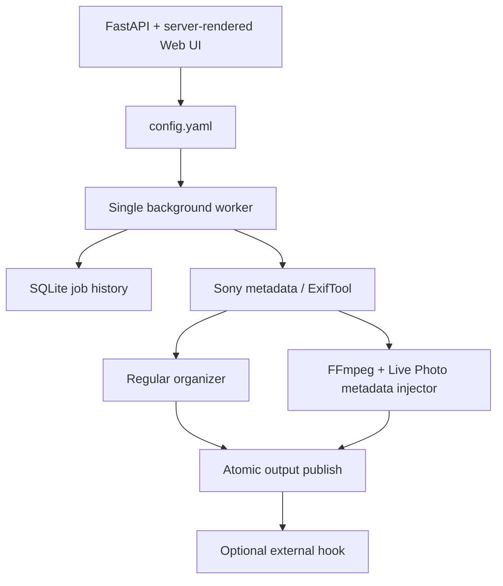

# Architecture

The service is one container and one Python process:

## Configuration ownership

`config.yaml` is the only runtime configuration source. The settings form
validates a complete Pydantic model, merges it into the YAML document, and
writes through a same-directory temporary file followed by `fsync` and
`os.replace`. The worker reloads the file every loop. SQLite stores status and
history only.

## Live Photo representation

The key image contains a generated Apple MakerNote with only:

- `MakerNoteVersion=16`
- the pair's `ContentIdentifier`
- `LivePhotoVideoIndex`

The motion file uses the same content identifier in direct movie metadata and
contains a `mebx` metadata track with one `still-image-time` sample at the clip
midpoint. The injector keeps that sample in the primary `mdat` and validates the
box tree before publishing.

## Failure boundaries

- Files are ignored until stable, so an active FTP transfer is not consumed.
- Every Shot Mark pair is staged before any pair from that source is published.
- Failed fingerprints wait for an explicit manual scan instead of retrying in a
  tight loop.
- Hook failure is recorded as a warning after successful publication; it does
  not roll back media files.
- Marked originals are archived only after every generated pair validates.
